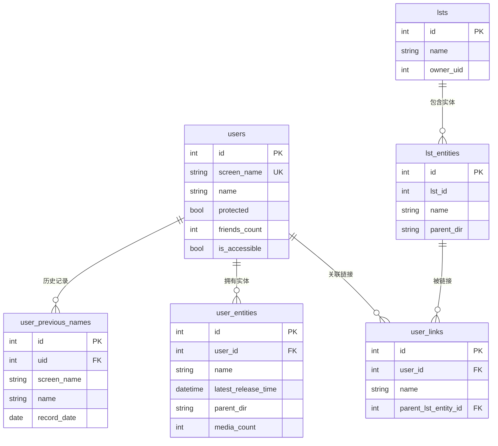
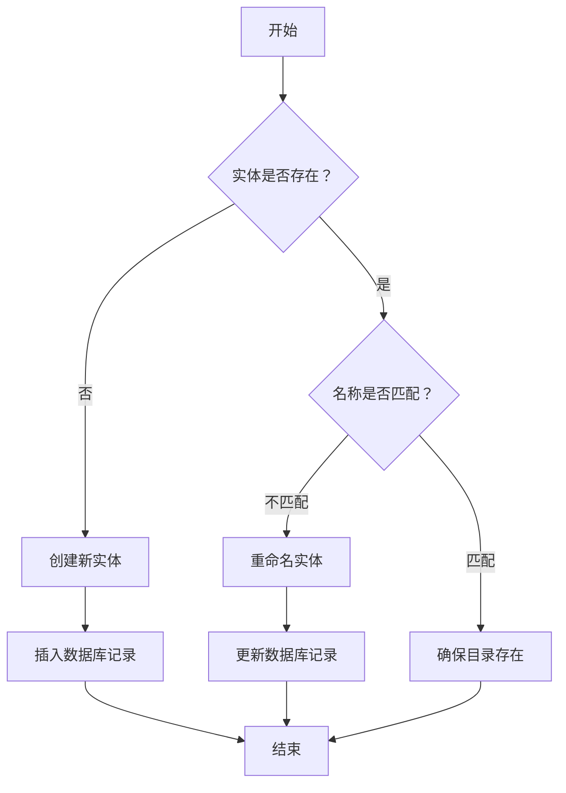
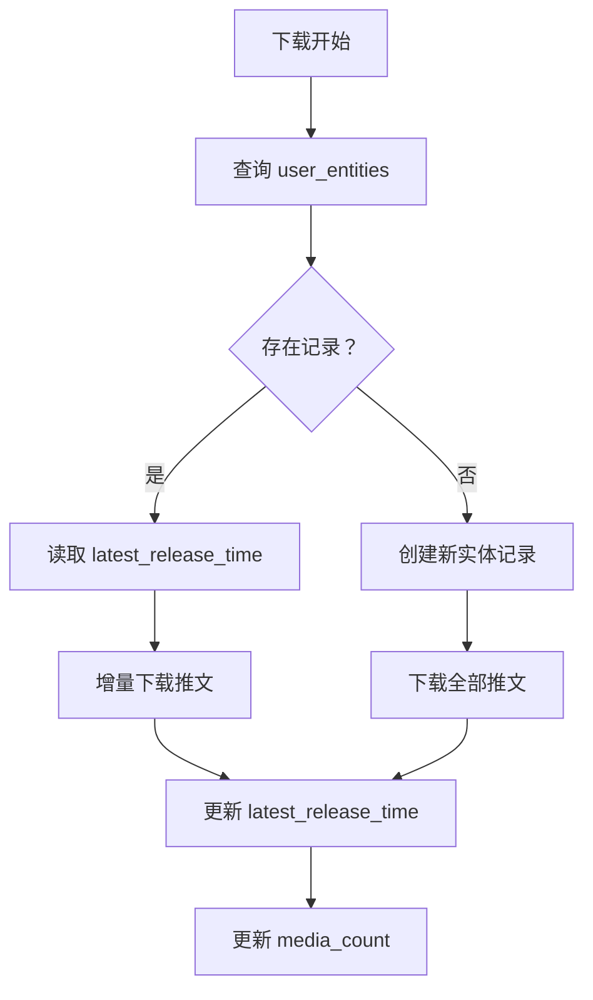
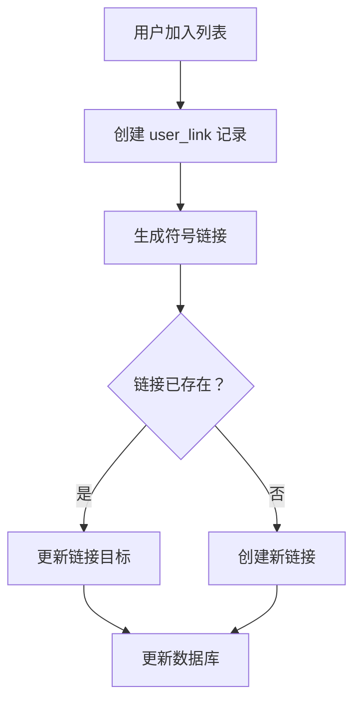

# foo.db 数据库技术文档

## 概述

`foo.db` 是 TMD（Twitter Media Downloader）项目的核心 SQLite 数据库文件，用于持久化存储用户信息、列表信息、下载实体记录以及用户与列表之间的关联关系。该数据库采用 SQLite3 实现，通过 `sqlx` 库进行 ORM 操作，支持 WAL（Write-Ahead Logging）模式以优化并发性能。

**数据库文件路径**: `<root_path>/.data/foo.db`

**依赖库**:

- `github.com/jmoiron/sqlx` - SQL 扩展库
- `github.com/mattn/go-sqlite3` - SQLite3 驱动

***

## 1. 数据库架构设计

### 1.1 设计理念

数据库采用关系型模型设计，主要服务于以下业务场景：

1. **用户管理**: 存储 Twitter 用户基本信息及历史名称记录
2. **列表管理**: 存储 Twitter 列表及其成员结构
3. **下载跟踪**: 记录已下载的用户和列表实体，支持断点续传
4. **关联映射**: 建立用户与列表之间的多对多关系

### 1.2 连接配置

```go
// 连接字符串配置
dsn := fmt.Sprintf("file:%s?_journal_mode=WAL&busy_timeout=2147483647", path)
db, err := sqlx.Connect("sqlite3", dsn)

// 关键参数说明:
// - _journal_mode=WAL: 启用预写日志模式，提升并发读写性能
// - busy_timeout=2147483647: 设置锁等待超时时间为最大值（约 36 分钟）
```

### 1.3 初始化流程

```go
func connectDatabase(path string) (*sqlx.DB, error) {
    ex, err := utils.PathExists(path)
    if err != nil {
        return nil, err
    }

    dsn := fmt.Sprintf("file:%s?_journal_mode=WAL&busy_timeout=2147483647", path)
    db, err := sqlx.Connect("sqlite3", dsn)
    if err != nil {
        return nil, err
    }
    
    // 自动创建表结构
    database.CreateTables(db)
    
    if !ex {
        log.Debugln("created new db file", path)
    }
    return db, nil
}
```

***

## 2. 表结构定义

### 2.1 表概览

| 表名                    | 用途             | 主键   | 外键                                                                 |
| --------------------- | -------------- | ---- | ------------------------------------------------------------------ |
| `users`               | Twitter 用户基本信息 | `id` | 无                                                                  |
| `user_previous_names` | 用户历史名称记录       | `id` | `uid` → `users.id`                                                 |
| `lsts`                | Twitter 列表信息   | `id` | 无                                                                  |
| `lst_entities`        | 列表下载实体记录       | `id` | 无                                                                  |
| `user_entities`       | 用户下载实体记录       | `id` | `user_id` → `users.id`                                             |
| `user_links`          | 用户与列表的关联       | `id` | `user_id` → `users.id`, `parent_lst_entity_id` → `lst_entities.id` |

### 2.2 详细表结构

#### 2.2.1 users 表

存储 Twitter 用户的基本信息。

```sql
CREATE TABLE IF NOT EXISTS users (
    id INTEGER NOT NULL,              -- Twitter 用户 ID（全局唯一）
    screen_name VARCHAR NOT NULL,     -- 用户屏幕名称（@用户名）
    name VARCHAR NOT NULL,            -- 用户显示名称
    protected BOOLEAN NOT NULL,       -- 是否受保护（私密账户）
    friends_count INTEGER NOT NULL,   -- 关注数量
    is_accessible BOOLEAN NOT NULL DEFAULT 1, -- 是否可通过 API 正常访问（非封禁/注销）
    PRIMARY KEY (id),
    UNIQUE (screen_name)
);
```

**字段说明**:

- `id`: Twitter 用户唯一标识符，对应 API 中的 `user_id`
- `screen_name`: 用户唯一标识名，用于 URL 和提及（如 `@elonmusk`）
- `name`: 用户自定义显示名称（可包含特殊字符和表情）
- `protected`: `true` 表示私密账户，需关注后才能查看内容
- `friends_count`: 用户关注的其他用户数量
- `is_accessible`: `true` 表示用户可正常访问，`false` 表示用户已封禁/注销（v2.8.0 新增，默认 1）

#### 2.2.2 user\_previous\_names 表

记录用户历史名称变更，用于追踪改名历史。

```sql
CREATE TABLE IF NOT EXISTS user_previous_names (
    id INTEGER NOT NULL,              -- 自增主键
    uid INTEGER NOT NULL,             -- 用户 ID（外键）
    screen_name VARCHAR NOT NULL,     -- 历史屏幕名称
    name VARCHAR NOT NULL,            -- 历史显示名称
    record_date DATE NOT NULL,        -- 记录时间戳
    PRIMARY KEY (id),
    FOREIGN KEY(uid) REFERENCES users (id)
);
```

**使用场景**: 当用户改名后，通过此表可以追溯到原始名称，便于文件关联。

#### 2.2.3 lsts 表

存储 Twitter 列表的基本信息。

```sql
CREATE TABLE IF NOT EXISTS lsts (
    id INTEGER NOT NULL,              -- 列表 ID
    name VARCHAR NOT NULL,            -- 列表名称
    owner_uid INTEGER NOT NULL,       -- 列表所有者用户 ID
    PRIMARY KEY (id)
);
```

#### 2.2.4 lst\_entities 表

记录已下载的列表实体，用于文件系统映射。

```sql
CREATE TABLE IF NOT EXISTS lst_entities (
    id INTEGER NOT NULL,              -- 自增主键
    lst_id INTEGER NOT NULL,          -- 列表 ID
    name VARCHAR NOT NULL,            -- 实体名称（目录名）
    parent_dir VARCHAR NOT NULL COLLATE NOCASE,  -- 父目录路径（大小写不敏感）
    PRIMARY KEY (id),
    UNIQUE (lst_id, parent_dir)
);
```

**唯一约束**: 同一列表在同一父目录下只能有一个实体记录。

#### 2.2.5 user\_entities 表

记录已下载的用户实体，包含下载状态信息。

```sql
CREATE TABLE IF NOT EXISTS user_entities (
    id INTEGER NOT NULL,              -- 自增主键
    user_id INTEGER NOT NULL,         -- 用户 ID（外键）
    name VARCHAR NOT NULL,            -- 实体名称（目录名）
    latest_release_time DATETIME,     -- 最新推文下载时间
    parent_dir VARCHAR COLLATE NOCASE NOT NULL,  -- 父目录路径
    media_count INTEGER,              -- 媒体文件数量
    PRIMARY KEY (id),
    UNIQUE (user_id, parent_dir),
    FOREIGN KEY(user_id) REFERENCES users (id)
);
```

**关键字段**:

- `latest_release_time`: 记录最新下载的推文时间，用于增量下载
- `media_count`: 统计该用户实体下的媒体文件总数

#### 2.2.6 user\_links 表

建立用户与列表实体之间的关联（符号链接）。

```sql
CREATE TABLE IF NOT EXISTS user_links (
    id INTEGER NOT NULL,              -- 自增主键
    user_id INTEGER NOT NULL,         -- 用户 ID（外键）
    name VARCHAR NOT NULL,            -- 链接名称
    parent_lst_entity_id INTEGER NOT NULL,  -- 列表实体 ID（外键）
    PRIMARY KEY (id),
    UNIQUE (user_id, parent_lst_entity_id),
    FOREIGN KEY(user_id) REFERENCES users (id),
    FOREIGN KEY(parent_lst_entity_id) REFERENCES lst_entities (id)
);
```

**用途**: 当用户属于多个列表时，通过符号链接在列表中创建用户目录的引用。

***

## 3. 索引设计

### 3.1 显式索引

```sql
CREATE INDEX IF NOT EXISTS idx_users_screen_name ON users(screen_name);
CREATE INDEX IF NOT EXISTS idx_users_name ON users(name);
CREATE INDEX IF NOT EXISTS idx_users_accessible ON users(is_accessible);
CREATE INDEX IF NOT EXISTS idx_users_protected ON users(protected);
CREATE INDEX IF NOT EXISTS idx_lsts_name ON lsts(name);
CREATE INDEX IF NOT EXISTS idx_lsts_owner ON lsts(owner_uid);
CREATE INDEX IF NOT EXISTS idx_user_entities_user_id ON user_entities(user_id);
CREATE INDEX IF NOT EXISTS idx_user_entities_name ON user_entities(name);
CREATE INDEX IF NOT EXISTS idx_lst_entities_lst_id ON lst_entities(lst_id);
CREATE INDEX IF NOT EXISTS idx_user_links_user_id ON user_links(user_id);
CREATE INDEX IF NOT EXISTS idx_user_links_lst_entity ON user_links(parent_lst_entity_id);
CREATE INDEX IF NOT EXISTS idx_user_previous_names_uid ON user_previous_names(uid);
```

**设计目的**:
- `idx_users_*`: 加速用户查询（按名称、可访问状态、保护状态筛选）
- `idx_lsts_*`: 加速列表查询（按名称、所有者筛选）
- `idx_user_entities_*`: 加速用户实体查询（按用户ID、名称筛选）
- `idx_lst_entities_lst_id`: 加速列表实体查询（按列表ID筛选）
- `idx_user_links_*`: 加速用户链接查询（按用户ID、列表实体ID筛选）
- `idx_user_previous_names_uid`: 加速历史名称查询（按用户ID筛选）

### 3.2 隐式索引

以下字段因 `UNIQUE` 约束自动创建唯一索引：

- `users.screen_name`
- `lst_entities(lst_id, parent_dir)`
- `user_entities(user_id, parent_dir)`
- `user_links(user_id, parent_lst_entity_id)`

### 3.3 索引使用场景分析

| 查询模式                                                               | 使用索引                          | 性能影响     |
| ------------------------------------------------------------------ | ----------------------------- | -------- |
| `SELECT * FROM user_links WHERE user_id = ?`                       | `idx_user_links_user_id`      | O(log n) |
| `SELECT * FROM users WHERE screen_name = ?`                        | `UNIQUE(screen_name)`         | O(1)     |
| `SELECT * FROM user_entities WHERE user_id = ? AND parent_dir = ?` | `UNIQUE(user_id, parent_dir)` | O(1)     |

***

## 4. 数据关系图



***

## 5. 核心业务逻辑流程

### 5.1 用户实体管理流程



**代码实现**:

```go
type UserEntity struct {
    record  *database.UserEntity
    db      *sqlx.DB
    created bool
}

func NewUserEntity(db *sqlx.DB, uid uint64, parentDir string) (*UserEntity, error) {
    created := true
    record, err := database.LocateUserEntity(db, uid, parentDir)
    if err != nil {
        return nil, err
    }
    if record == nil {
        record = &database.UserEntity{}
        record.Uid = uid
        record.ParentDir = parentDir
        created = false
    }
    return &UserEntity{record: record, db: db, created: created}, nil
}

func (ue *UserEntity) Create(name string) error {
    ue.record.Name = name
    path, _ := ue.Path()
    if err := os.MkdirAll(path, 0755); err != nil {
        return err
    }

    if err := database.CreateUserEntity(ue.db, ue.record); err != nil {
        return err
    }
    ue.created = true
    return nil
}
```

### 5.2 下载进度跟踪流程



**关键代码**:

```go
func (ue *UserEntity) SetLatestReleaseTime(t time.Time) error {
    if !ue.created {
        return fmt.Errorf("user entity was not created")
    }
    err := database.SetUserEntityLatestReleaseTime(ue.db, int(ue.record.Id.Int32), t)
    if err == nil {
        ue.record.LatestReleaseTime.Scan(t)
    }
    return err
}
```

### 5.3 用户 - 列表关联管理



***

## 6. 关键 API 接口说明

### 6.1 用户操作 API

#### CreateUser

```go
func CreateUser(db *sqlx.DB, usr *User) error
```

**功能**: 插入新用户记录\
**参数**:

- `db`: 数据库连接
- `usr`: 用户对象，包含 `Id`, `ScreenName`, `Name`, `IsProtected`, `FriendsCount`, `IsAccessible`\
  **返回值**: 错误信息

**SQL**:

```sql
INSERT INTO Users(id, screen_name, name, protected, friends_count) 
VALUES(:id, :screen_name, :name, :protected, :friends_count)
```

#### GetUserById

```go
func GetUserById(db *sqlx.DB, uid uint64) (*User, error)
```

**功能**: 通过 ID 查询用户\
**特殊处理**: 如果记录不存在，返回 `nil` 而非错误

#### UpdateUser

```go
func UpdateUser(db *sqlx.DB, usr *User) error
```

**功能**: 更新用户信息（支持改名）

#### RecordUserPreviousName

```go
func RecordUserPreviousName(db *sqlx.DB, uid uint64, name string, screenName string) error
```

**功能**: 记录用户历史名称（改名时调用）

### 6.2 实体操作 API

#### CreateUserEntity

```go
func CreateUserEntity(db *sqlx.DB, entity *UserEntity) error
```

**功能**: 创建用户下载实体记录\
**自动处理**:

- 将相对路径转换为绝对路径
- 返回自增 ID 并填充到实体对象

#### LocateUserEntity

```go
func LocateUserEntity(db *sqlx.DB, uid uint64, parentDir string) (*UserEntity, error)
```

**功能**: 定位用户实体（通过 `user_id` + `parent_dir` 唯一索引）\
**返回值**: 不存在时返回 `nil, nil`

#### SetUserEntityLatestReleaseTime

```go
func SetUserEntityLatestReleaseTime(db *sqlx.DB, id int, t time.Time) error
```

**功能**: 更新最新推文下载时间\
**用途**: 断点续传标记

### 6.3 列表操作 API

与用户操作类似，提供 `CreateLst`, `GetLst`, `UpdateLst`, `DelLst` 等函数。

### 6.4 关联操作 API

#### CreateUserLink

```go
func CreateUserLink(db *sqlx.DB, lnk *UserLink) error
```

**功能**: 创建用户 - 列表关联

#### GetUserLinks

```go
func GetUserLinks(db *sqlx.DB, uid uint64) ([]*UserLink, error)
```

**功能**: 获取用户的所有列表关联

***

## 7. 数据读写操作规范

### 7.1 写入操作规范

1. **路径标准化**: 所有路径字段在写入前必须转换为绝对路径
   ```go
   abs, err := filepath.Abs(entity.ParentDir)
   if err != nil {
       return err
   }
   entity.ParentDir = abs
   ```
2. **事务处理**: 批量操作应使用事务（当前实现未显式使用事务，建议优化）
3. **唯一性约束**: 插入前检查是否违反唯一约束，或使用 `INSERT OR REPLACE`
4. **数据库迁移**: 新增字段通过 `MigrateDatabase()` 函数自动迁移，支持重复执行

### 7.2 读取操作规范

1. **空值处理**: `sql.NullInt32` 和 `sql.NullTime` 字段需检查 `Valid` 标志
   ```go
   type UserEntity struct {
       Id         sql.NullInt32 `db:"id"`
       LatestReleaseTime sql.NullTime `db:"latest_release_time"`
   }
   ```
2. **错误处理**: `sql.ErrNoRows` 应转换为 `nil` 返回值

### 7.3 并发控制

- **WAL 模式**: 支持多读单写
- **busy\_timeout**: 设置最大等待时间避免死锁
- **应用层锁**: 使用 `sync.Mutex` 保护关键操作

***

## 8. 异常处理机制

### 8.1 常见错误及处理

| 错误类型            | 触发场景     | 处理策略          |
| --------------- | -------- | ------------- |
| `sql.ErrNoRows` | 查询记录不存在  | 返回 `nil` 而非错误 |
| 唯一约束冲突          | 重复插入     | 检查后更新或忽略      |
| 外键约束失败          | 引用不存在的记录 | 先创建父记录        |
| 路径转换失败          | 无效路径     | 返回错误并终止操作     |

### 8.2 错误处理示例

```go
func GetUserById(db *sqlx.DB, uid uint64) (*User, error) {
    stmt := `SELECT * FROM users WHERE id=?`
    result := &User{}
    err := db.Get(result, stmt, uid)
    
    if err == sql.ErrNoRows {
        result = nil
        err = nil  // 转换为 nil，调用方检查 nil 即可
    }
    if err != nil {
        return nil, err
    }
    return result, nil
}
```

### 8.3 数据一致性保障

1. **外键约束**: 通过 `FOREIGN KEY` 确保引用完整性
2. **唯一索引**: 防止重复记录
3. **NOT NULL 约束**: 确保必填字段不为空

***

## 9. 性能优化策略

### 9.1 数据库层面优化

#### 9.1.1 WAL 模式优势

```sql
_journal_mode=WAL
```

- **并发提升**: 读写不阻塞
- **崩溃恢复**: 更快的恢复速度
- **适用场景**: 读多写少的下载跟踪场景

#### 9.1.2 Busy Timeout

```sql
_busy_timeout=2147483647
```

- 避免因短暂锁竞争导致的失败
- 适合长时间运行的下载任务

### 9.2 查询优化

#### 9.2.1 使用参数化查询

```go
// 推荐
db.Get(result, `SELECT * FROM users WHERE id=?`, uid)

// 不推荐：字符串拼接（SQL 注入风险）
```

#### 9.2.2 利用索引

```go
// 高效：使用唯一索引
LocateUserEntity(db, uid, parentDir)

// 低效：全表扫描
GetUserEntity(db, name)  // name 字段无索引
```

### 9.3 批量操作优化

**当前实现**: 单条插入\
**建议优化**: 使用批量插入减少 I/O

```go
// 优化示例（伪代码）
tx := db.Begin()
for _, entity := range entities {
    tx.Exec(`INSERT INTO ...`, entity)
}
tx.Commit()
```

### 9.4 基准测试结果

```go
// 来自 db_test.go 的基准测试
func BenchmarkUpdateUser1(b *testing.B) {
    benchmarkUpdateUser(b, 1)   // 单协程
}

func BenchmarkUpdateUser24(b *testing.B) {
    benchmarkUpdateUser(b, 24)  // 24 协程并发
}
```

**测试结论**:

- WAL 模式下，并发更新性能随协程数增加而提升
- 24 协程时吞吐量约为单协程的 15-20 倍

***

## 10. 维护要点

### 10.1 数据库备份

定期备份 `foo.db` 及其 WAL 文件：

```bash
cp <root_path>/.data/foo.db backup.db
cp <root_path>/.data/foo.db-wal backup.db-wal  # 如果有
cp <root_path>/.data/foo.db-shm backup.db-shm  # 如果有
```

### 10.2 数据清理

清理无效历史名称记录：

```sql
DELETE FROM user_previous_names WHERE record_date < date('now', '-1 year');
```

### 10.3 性能监控

定期检查数据库文件大小和表记录数：

```sql
SELECT 
    'users' as table_name, COUNT(*) as row_count FROM users
UNION ALL
SELECT 'user_entities', COUNT(*) FROM user_entities
UNION ALL
SELECT 'user_links', COUNT(*) FROM user_links;
```

### 10.4 常见问题排查

#### 问题 1: 数据库锁死

**症状**: 操作长时间阻塞\
**解决**:

1. 检查是否有未提交的事务
2. 重启应用释放锁
3. 考虑优化事务粒度

#### 问题 2: 数据不一致

**症状**: 外键引用失败\
**解决**:

1. 启用外键约束：`PRAGMA foreign_keys = ON`
2. 运行一致性检查脚本

***

## 11. 开发指南

### 11.1 添加新表

1. 在 `model.go` 中定义结构体
2. 在 `crud.go` 的 `schema` 常量中添加 `CREATE TABLE` 语句
3. 实现 CRUD 函数
4. 编写单元测试

### 11.2 扩展现有表

```go
// 示例：为 users 表添加 created_at 字段
// 1. 修改 schema
const schema = `
CREATE TABLE IF NOT EXISTS users (
    id INTEGER NOT NULL,
    -- ... 现有字段 ...
    created_at DATETIME DEFAULT CURRENT_TIMESTAMP
);
`

// 2. 更新模型
type User struct {
    // ... 现有字段 ...
    CreatedAt time.Time `db:"created_at"`
}

// 3. 添加迁移逻辑（如需要）
func MigrateUsers(db *sqlx.DB) error {
    _, err := db.Exec(`ALTER TABLE users ADD COLUMN created_at DATETIME DEFAULT CURRENT_TIMESTAMP`)
    return err
}
```

### 11.3 编写测试

```go
func TestUserEntity(t *testing.T) {
    db := opentmpdb()
    defer db.Close()
    
    entity := generateUserEntity(1, os.TempDir())
    
    // 测试创建
    if err := CreateUserEntity(db, entity); err != nil {
        t.Error(err)
        return
    }
    
    // 测试查询
    retrieved, err := GetUserEntity(db, int(entity.Id.Int32))
    if err != nil || *retrieved != *entity {
        t.Error("record mismatch")
    }
}
```

***

## 12. 附录

### 12.1 完整 Schema 脚本

```sql
-- 完整数据库结构脚本
-- 生成时间：2026-03-27

CREATE TABLE IF NOT EXISTS users (
    id INTEGER NOT NULL,
    screen_name VARCHAR NOT NULL,
    name VARCHAR NOT NULL,
    protected BOOLEAN NOT NULL,
    friends_count INTEGER NOT NULL,
    is_accessible BOOLEAN NOT NULL DEFAULT 1,
    PRIMARY KEY (id),
    UNIQUE (screen_name)
);

CREATE TABLE IF NOT EXISTS user_previous_names (
    id INTEGER NOT NULL,
    uid INTEGER NOT NULL,
    screen_name VARCHAR NOT NULL,
    name VARCHAR NOT NULL,
    record_date DATE NOT NULL,
    PRIMARY KEY (id),
    FOREIGN KEY(uid) REFERENCES users (id)
);

CREATE TABLE IF NOT EXISTS lsts (
    id INTEGER NOT NULL,
    name VARCHAR NOT NULL,
    owner_uid INTEGER NOT NULL,
    PRIMARY KEY (id)
);

CREATE TABLE IF NOT EXISTS lst_entities (
    id INTEGER NOT NULL,
    lst_id INTEGER NOT NULL,
    name VARCHAR NOT NULL,
    parent_dir VARCHAR NOT NULL COLLATE NOCASE,
    PRIMARY KEY (id),
    UNIQUE (lst_id, parent_dir)
);

CREATE TABLE IF NOT EXISTS user_entities (
    id INTEGER NOT NULL,
    user_id INTEGER NOT NULL,
    name VARCHAR NOT NULL,
    latest_release_time DATETIME,
    parent_dir VARCHAR COLLATE NOCASE NOT NULL,
    media_count INTEGER,
    PRIMARY KEY (id),
    UNIQUE (user_id, parent_dir),
    FOREIGN KEY(user_id) REFERENCES users (id)
);

CREATE TABLE IF NOT EXISTS user_links (
    id INTEGER NOT NULL,
    user_id INTEGER NOT NULL,
    name VARCHAR NOT NULL,
    parent_lst_entity_id INTEGER NOT NULL,
    PRIMARY KEY (id),
    UNIQUE (user_id, parent_lst_entity_id),
    FOREIGN KEY(user_id) REFERENCES users (id),
    FOREIGN KEY(parent_lst_entity_id) REFERENCES lst_entities (id)
);

CREATE INDEX IF NOT EXISTS idx_user_links_user_id ON user_links (user_id);

-- 索引
CREATE INDEX IF NOT EXISTS idx_users_screen_name ON users(screen_name);
CREATE INDEX IF NOT EXISTS idx_users_name ON users(name);
CREATE INDEX IF NOT EXISTS idx_users_accessible ON users(is_accessible);
CREATE INDEX IF NOT EXISTS idx_users_protected ON users(protected);
CREATE INDEX IF NOT EXISTS idx_lsts_name ON lsts(name);
CREATE INDEX IF NOT EXISTS idx_lsts_owner ON lsts(owner_uid);
CREATE INDEX IF NOT EXISTS idx_user_entities_user_id ON user_entities(user_id);
CREATE INDEX IF NOT EXISTS idx_user_entities_name ON user_entities(name);
CREATE INDEX IF NOT EXISTS idx_lst_entities_lst_id ON lst_entities(lst_id);
CREATE INDEX IF NOT EXISTS idx_user_links_lst_entity ON user_links(parent_lst_entity_id);
CREATE INDEX IF NOT EXISTS idx_user_previous_names_uid ON user_previous_names(uid);
```

### 12.2 相关文件清单

| 文件路径                             | 用途        |
| -------------------------------- | --------- |
| `internal/database/model.go`     | 数据模型定义    |
| `internal/database/schema.go`    | Schema 定义 |
| `internal/database/crud.go`      | CRUD 操作实现 |
| `internal/database/connect.go`   | 数据库连接与迁移  |
| `internal/database/helpers.go`   | 辅助查询函数    |
| `internal/database/user.go`      | 用户相关操作    |
| `internal/database/user_entity.go` | 用户实体操作  |
| `internal/database/user_link.go` | 用户链接操作    |
| `internal/database/lst.go`       | 列表相关操作    |
| `internal/database/lst_entity.go` | 列表实体操作   |
| `internal/database/user_sync.go` | 用户同步操作    |
| `internal/database/db_test.go`   | 单元测试      |
| `internal/downloading/entity.go` | 实体管理封装    |
| `internal/downloading/dumper.go` | 失败数据转储    |
| `main.go`                        | 数据库初始化入口  |

### 12.3 参考资料

- [SQLite 官方文档](https://www.sqlite.org/docs.html)
- [sqlx GitHub](https://github.com/jmoiron/sqlx)
- [SQLite WAL 模式详解](https://www.sqlite.org/wal.html)

***

## 文档版本

- **版本**: 1.1
- **更新日期**: 2026-04-27
- **作者**: AI Assistant
- **适用版本**: TMD v3.0.3

